# B&W Flower Image Colorization
<small>Elad Shabi, Nadav Dori, Chen Shmilovich</small>

In the following code we built a convolutional neural network using keras library, 
that gets as an input 32X32 pixels grayscale images of flowers, and generates an output of 96X96 colored flowers images.

* <b>Data-Sets</b> 
We used a data set that contains 8189 pairs of grayscale and colored flower images 
The training set is consisted of 70% of the images, while the test set is consisted of 30% of them. 10% of the training images are used for validation. 

* <b>Model's Network Architecture</b> 
We've been experimenting with several different designs of the network. 
In every model we chose to use RELU activation function on the hidden layers of the network. 
On the output layer we used sigmoid function in order to output values between 0 and 1. 
Generally the network processed the input image in such a way that it has been shrinked on the first few layers and than upscaled to the desired output dimensions. We used strides and up-sampling in order to do so. 
We achieved the best results for this assignment using the described method. 
Overfitting on these kind of networks is a subjective matter, therefore we needed to examine the results and determine wether they match our expectations.

* <b>Model's Training</b> 
We normalized the input pixel values to be between 0 and 1, and used the mean square error loss function to measure our results. 
After that we also tried using the "msle" loss function which we found more suitable for our project.
On both occasions we used the "rmsprop" optimizer to minimize our loss.

* <b>Performance</b> 
We were suprised by our initial results, it seemed like the network recognized the shapes and textures of the input images, and also colored them nicely. 
The only issue we had is the lack of sharpness of the output images. 
We then added more convolutional layers to deepen our network and we increased the amount of filters in each layer dramatically. Furthermore we tested different batch sizes and number of epochs. 
The output images became more sharp and clear, the results were way over our expectations.

* <b>Results:</b> 
<table style="float:left">
    <tr>
        <th style="text-align:center">Input</th>
        <th style="text-align:center">Model A</th>
        <th style="text-align:center">Model B</th>
        <th style="text-align:center">Model C</th>
    </tr>
    <tr>
        <td></img></td>
        <td>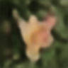</img></td>
        <td>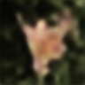</img></td>
        <td></img></td>
    </tr>
    <tr>
        <td></img></td>
        <td></img></td>
        <td></img></td>
        <td></img></td>
    </tr>
    <tr>
        <td></img></td>
        <td>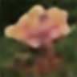</img></td>
        <td>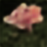</img></td>
        <td></img></td>
    </tr>
    <tr>
        <td></img></td>
        <td></img></td>
        <td></img></td>
        <td></img></td>
    </tr>
    <tr>
        <td></img></td>
        <td>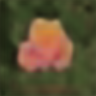</img></td>
        <td></img></td>
        <td></img></td>
    </tr>
    <tr>
        <td></img></td>
        <td></img></td>
        <td>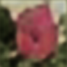</img></td>
        <td></img></td>
    </tr>
    <tr>
        <td></img></td>
        <td>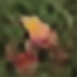</img></td>
        <td></img></td>
        <td></img></td>
    </tr>
    <tr>
        <td></img></td>
        <td></img></td>
        <td>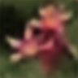</img></td>
        <td></img></td>
    </tr>
    <tr>
        <td></img></td>
        <td></img></td>
        <td>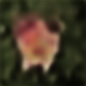</img></td>
        <td></img></td>
    </tr>
    <tr>
        <td></img></td>
        <td>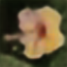</img></td>
        <td>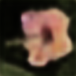</img></td>
        <td></img></td>
    </tr>
    <tr>
        <td></img></td>
        <td></img></td>
        <td></img></td>
        <td></img></td>
    </tr>
    <tr>
        <td></img></td>
        <td>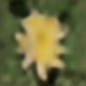</img></td>
        <td>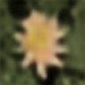</img></td>
        <td></img></td>
    </tr>
    <tr>
        <td></img></td>
        <td></img></td>
        <td></img></td>
        <td></img></td>
    </tr>
    <tr>
        <td>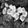</img></td>
        <td></img></td>
        <td>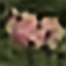</img></td>
        <td></img></td>
    </tr>
    <tr>
        <td></img></td>
        <td></img></td>
        <td></img></td>
        <td></img></td>
    </tr>
    <tr>
        <td></img></td>
        <td></img></td>
        <td></img></td>
        <td></img></td>
    </tr>
    <tr>
        <td></img></td>
        <td></img></td>
        <td></img></td>
        <td></img></td>
    </tr>
    <tr>
        <td></img></td>
        <td></img></td>
        <td></img></td>
        <td></img></td>
    </tr>
    <tr>
        <td></img></td>
        <td></img></td>
        <td>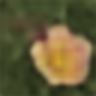</img></td>
        <td></img></td>
    </tr>
    <tr>
        <td></img></td>
        <td></img></td>
        <td>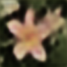</img></td>
        <td></img></td>
    </tr>
    <tr>
        <td></img></td>
        <td>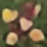</img></td>
        <td></img></td>
        <td></img></td>
    </tr>
</table>
